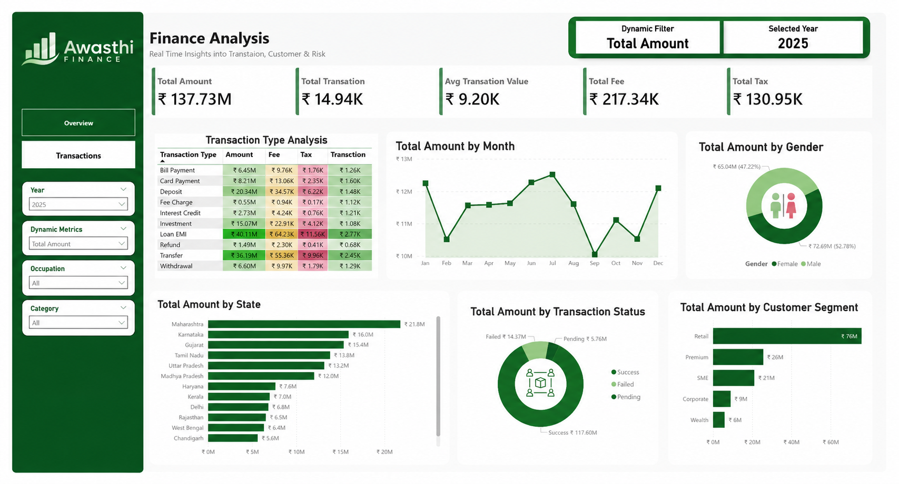
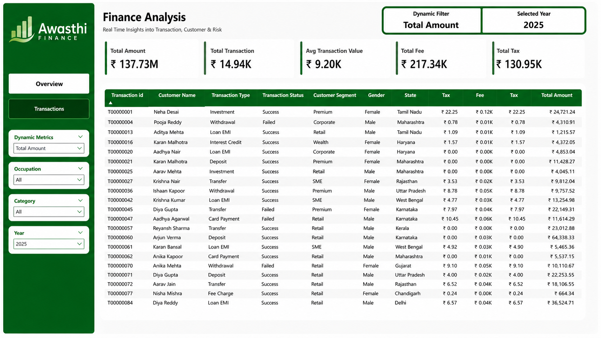

# 📊 Finance Analysis Dashboard — Power BI


<br>
A multi-page interactive financial analytics dashboard built with Power BI Desktop using a synthetic transaction and customer dataset. Covers end-to-end analysis — from data modeling to dynamic DAX measures to visual storytelling.

---

## 📸 Dashboard Preview

### Overview Page



### Transactions Page



---

## 🎯 Key Insights & Business Questions Answered

This dashboard translates financial transaction data into actionable business intelligence by addressing key operational questions:

* **How are transaction volumes and sales trending over time?**
  * *Insight:* Total sales reached **₹137.73M** across **14.94K** transactions (with an average transaction value of **₹9.20K**). Revenue peaks during the mid-year months (Jul–Aug) and experiences a notable seasonal dip in Sep–Oct.
* **Which customer segments and demographics drive the most revenue?**
  * *Insight:* The **Retail** customer segment is the primary revenue driver, contributing **₹76M** (over 55% of total sales). Revenue distribution remains highly balanced across gender demographics: Male (**52.78%**) vs. Female (**47.22%**).
* **Which transaction types and regions generate the highest value?**
  * *Insight:* **Maharashtra** dominates regional sales, generating **₹22M**, followed by Karnataka at **₹16M**. Among transaction types, **Loan EMI** payments drive the highest transaction value, accounting for **₹40.11M**.
* **What is our success rate, and where are the primary financial risks?**
  * *Insight:* While the overall transaction success rate is healthy at **85%+** (₹117.60M), **failed transactions represent ₹14.37M** of value, highlighting a critical risk area for operational improvement and fraud/leakage audits.

---

## 🗂️ Data Model

The report uses a **star schema** data model consisting of a central fact table and associated dimension and helper tables:

| Table | Type | Key Fields |
| :--- | :--- | :--- |
| `Transactions` | Fact | `transaction_id`, `customer_id`, `account_id`, `transaction_date`, `amount`, `fee_amount`, `tax_amount` |
| `Customers` | Dimension | `customer_id`, `first_name`, `second_name`, `gender`, `occupation`, `state`, `customer_segment` |
| `Metrics` | Dimension (Helper) | `Metric` (used for the dynamic switcher slicer) |

> Relationships follow a standard one-to-many pattern from the `Customers` dimension table to the `Transactions` fact table, joined on `customer_id`. Relationships are configured to ensure clean self-serve reporting and avoid incorrect aggregations.

### 🧹 Data Prep & ETL (Power Query)
Before modeling, the raw transactional and customer datasets underwent clean-up in Power Query:
* **Text Cleansing:** Trimmed and cleaned whitespace from text columns (e.g., standardizing transaction channels and categories like `   Net Banking` and `ATM  `).
* **Type Safety:** Verified date columns are structured in `Date` format and transaction values (`amount`, `fee_amount`, `tax_amount`) are structured as `Fixed Decimal Number` (Currency).
* **Standardization:** Normalized categorical fields (such as status and transaction types) to ensure consistent aggregations and cleaner visualization hierarchies.

---

## 📄 Report Pages

### 1. Overview

High-level business performance dashboard showcasing sales trends, key demographics, and transaction types.

**Visuals:**
- **KPI Cards** — Total Sales (₹137.73M), Total Transactions (14.94K), Avg Transaction Value (₹9.20K), Total Fees (₹217.34K), and Total Tax (₹130.95K).
- **Area Chart** — Monthly trend of Total Sales, highlighting seasonal peaks in July/August and dips in September/October.
- **Donut Charts** — Visual breakdown of sales by transaction status (Success vs. Failed vs. Pending) and gender demographics (Male vs. Female).
- **Bar Charts** — Total sales analyzed by Customer Segment (Retail, SME, Corporate, etc.) and State-wise distribution (Maharashtra, Karnataka, etc.).
- **Matrix Table** — In-depth view of transaction types (e.g., Loan EMI, Transfer, Deposit) mapped against selected metrics.

**Key Insight:** Retail customers are the primary driver at ₹76M. Loan EMIs lead transaction types at ₹40.11M.

---

### 2. Transactions

A detailed tabular reporting sheet providing transaction-level granularity for deep-dive audits.

**Visuals:**
- **Detail Table** — Fully interactive table displaying transaction IDs, customer names, types, transaction status, segment, state, tax, fees, and final sales amounts.
- **Dynamic Slicers** — Interactive slicers filtering the entire report page by Year, Occupation, Category, and the active Dynamic Metric.

---

## 🧮 Key DAX Measures

| Measure | Description |
| :--- | :--- |
| `Total Sales` | `SUM(Transactions[Amount])` |
| `Total Transactions` | `COUNTROWS(Transactions)` |
| `Avg Transaction Value` | `AVERAGEX(Transactions, Transactions[Amount])` |
| `Selected Metric` | Dynamically switches active metrics using `SWITCH` and `SELECTEDVALUE` |
| `Success Rate %` | Percentage of successful transactions over total |

```dax
-- Total Sales: Calculates the overall sum of transaction amounts
Total Sales = SUM(Transactions[Amount])

-- Total Transactions: Counts the number of transaction rows
Total Transactions = COUNTROWS(Transactions)

-- Average Transaction Value: Computes average transaction amount safely
Avg Transaction Value = AVERAGEX(Transactions, Transactions[Amount])

-- Dynamic Metric Switcher: Toggles visuals between sales, fees, taxes, and average transaction values based on slicer selection
Selected Metric = 
SWITCH(
    SELECTEDVALUE('Metrics'[Metric]),
    "Total Sales",            [Total Sales],
    "Total Fee",              SUM(Transactions[Fee]),
    "Total Tax",              SUM(Transactions[Tax]),
    "Avg Transaction Value",  [Avg Transaction Value],
    [Total Sales]
)

-- Transaction Success Rate: Calculates percentage of successful transactions
Success Rate % = 
DIVIDE(
    CALCULATE(COUNTROWS(Transactions), Transactions[Status] = "Success"),
    COUNTROWS(Transactions)
)
```

---

## ⚡ Interactive Features

- **Dynamic Metric Switcher** — Configured a parameter table and advanced DAX measures to enable a single slicer that toggles the metric displayed across all visuals simultaneously.
- **Interactive Slicers** — Designed interactive slicers for Year, Occupation, and Transaction Category, allowing users to slice transaction detail records smoothly.
- **Drill-Through Detail** — Integrated a direct navigation path from high-level Overview cards to transaction-level detail, filtered automatically by the user's focus area.

---

## 🛠️ Tools & Skills Used

- **Power BI Desktop** — Dashboard authoring, layout design, and visualization construction
- **DAX (Data Analysis Expressions)** — Developing calculated measures and dynamic switcher logic
- **Power Query (M)** — Advanced ETL, text trimming, data cleaning, and column standardizations
- **Star Schema Modeling** — Formulating relationships between transactional facts and customer dimension tables
- **Financial Analytics** — KPI design, success rate modeling, and revenue leakage analysis

---

## 📁 File Structure

```
📦 finance-analysis-dashboard
 ┣ 📁 Dashboard_Images/
 ┃ ┣ 🖼️ Overview.jpg              # Overview page screenshot
 ┃ ┗ 🖼️ Transaction.jpg           # Transactions page screenshot
 ┣ 📁 data_set_used/
 ┃ ┣ 📄 customers.csv             # Customer demographic records
 ┃ ┗ 📄 finance_transactions.csv   # Transaction history records
 ┣ 📄 Business_Requirements.docx    # Stakeholder KPI & dashboard specifications
 ┣ 📊 finance_dashboard.pbix        # Main Power BI dashboard file
 ┗ 📄 README.md                     # Project documentation
```

---

## 🚀 How to Open

1. Download and install [Power BI Desktop](https://powerbi.microsoft.com/desktop/) (free)
2. Clone or download this repository
3. Open `finance_dashboard.pbix` in Power BI Desktop
4. Explore the report pages and interact with slicers

---

## 💡 What I Learned

- Building a dynamic metric switching system using DAX `SWITCH` and `SELECTEDVALUE` to optimize screen real estate and deliver flexible views.
- Cleaning messy real-world datasets in Power Query, including handling whitespace inconsistencies in text columns.
- Designing interactive transaction dashboards that drill down from corporate-level KPIs to line-item audit details.
- Analyzing transactional risk by tracking failed transactions and success percentages.
- Implementing a business-first design approach by mapping stakeholders' questions in a requirement document before constructing visual assets.

---

## 👤 Author

**Yash Awasthi**  
BCA (AI & Data Science)  
📧 yashonwork247@gmail.com  
🔗 [LinkedIn](https://linkedin.com/in/yashawasthi27) | [GitHub](https://github.com/yashawasthi27) | [Portfolio](https://yashawasthi27.github.io/Portfolio/)

---

> _Part of my ongoing Data Analytics learning journey. Built as a hands-on project to practice Power BI data modeling and DAX._