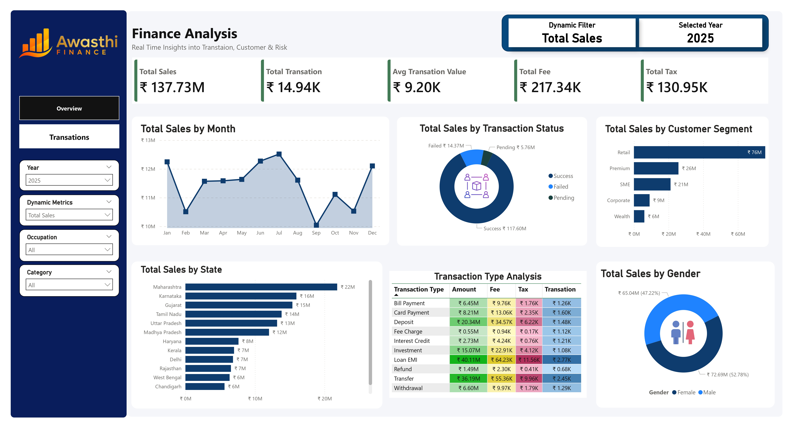
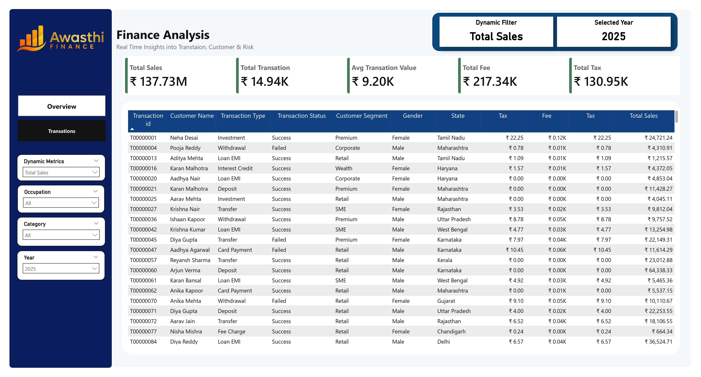

<div align="center">

# 💰 Finance Analysis Dashboard
### *Real-Time Insights into Transactions, Customer Behaviour & Risk*


<br>

[](https://linkedin.com/in/yashawasthi27)
[](https://yashawasthi27.github.io/Portfolio/)
[](https://github.com/yashawasthi27)

</div>

---

## 📌 Overview

The **Finance Analysis Dashboard** is a professional, multi-page Power BI report built for **Awasthi Finance**. It delivers real-time visibility into transaction volumes, sales performance, customer segments, and regional distribution — all powered by a dynamic DAX-based metric switching system.

This project covers the complete Power BI development lifecycle:

> `Data Ingestion` → `Power Query Transformation` → `Data Modelling` → `DAX Measures` → `Report Design`

---

## 🖥️ Dashboard Preview

### 📊 Overview Page


### 📋 Transactions Page

---

## 📊 Key KPIs — Year 2025

<div align="center">

| KPI | Value |
|:---|:---|
| 💵 Total Sales | ₹ 137.73M |
| 🔁 Total Transactions | 14.94K |
| 📈 Avg Transaction Value | ₹ 9.20K |
| 🏦 Total Fee Collected | ₹ 217.34K |
| 🧾 Total Tax | ₹ 130.95K |

</div>

---

## 📂 Dashboard Pages

### 1️⃣ Overview Page

| Visual | Chart Type | Key Finding |
|--------|-----------|-------------|
| Total Sales by Month | Area Chart | Revenue peaks in Jul–Aug; notable dip in Sep–Oct |
| Total Sales by Transaction Status | Donut Chart | Success ₹117.60M \| Failed ₹14.37M \| Pending ₹5.76M |
| Total Sales by Customer Segment | Bar Chart | Retail leads at ₹76M — highest among all segments |
| Total Sales by State | Bar Chart | Maharashtra #1 at ₹22M, Karnataka #2 at ₹16M |
| Transaction Type Analysis | Matrix Table | Loan EMI is highest value type at ₹40.11M |
| Total Sales by Gender | Donut Chart | Male 52.78% \| Female 47.22% |

### 2️⃣ Transactions Page

A fully interactive drill-down table with transaction-level detail:

- **Transaction ID, Customer Name, Transaction Type, Status**
- **Customer Segment, Gender, State**
- **Tax, Fee & Total Sales** — per individual transaction
- Filterable via **Year, Dynamic Metrics, Occupation & Category** slicers

---

## 🎛️ Dynamic Filtering System

The dashboard features a **Dynamic Metric Switcher** — a single slicer that switches ALL visuals between different metrics simultaneously using DAX `SWITCH` + `SELECTEDVALUE`.

| Slicer | Function |
|--------|----------|
| 📅 Year | Filters all visuals for selected fiscal year |
| 📐 Dynamic Metrics | Toggles between Total Sales / Total Fee / Total Tax / Avg Transaction Value |
| 👤 Occupation | Filters by customer occupation category |
| 🗂️ Category | Filters by transaction category |

---

## 🛠️ Tech Stack

| Tool | Usage |
|------|-------|
| **Power BI Desktop** | Report design, data modelling, DAX calculations |
| **DAX (Data Analysis Expressions)** | KPI measures, dynamic switching, aggregations |
| **Power Query (M Language)** | Data cleaning, transformation & shaping |
| **Excel / CSV** | Source dataset preparation |

---

## 🧠 DAX Measures

```dax
-- Total Sales
Total Sales = SUM(Transactions[Amount])

-- Total Transactions
Total Transactions = COUNTROWS(Transactions)

-- Average Transaction Value
Avg Transaction Value = AVERAGEX(Transactions, Transactions[Amount])

-- Dynamic Metric Switcher (Core Feature)
Selected Metric =
SWITCH(
    SELECTEDVALUE('Metrics'[Metric]),
    "Total Sales",            [Total Sales],
    "Total Fee",              SUM(Transactions[Fee]),
    "Total Tax",              SUM(Transactions[Tax]),
    "Avg Transaction Value",  [Avg Transaction Value],
    [Total Sales]
)

-- Transaction Success Rate
Success Rate % =
DIVIDE(
    CALCULATE(COUNTROWS(Transactions), Transactions[Status] = "Success"),
    COUNTROWS(Transactions)
)
```

---

## 💡 Key Business Insights

| # | Insight |
|---|---------|
| 🏆 | **Retail** is the dominant segment — contributing **₹76M** (55%+ of total revenue) |
| 🏙️ | **Maharashtra** leads all states at **₹22M**, followed by Karnataka at **₹16M** |
| 💳 | **Loan EMI** is the highest-value transaction type at **₹40.11M** |
| ✅ | **85%+ transactions are successful** — ₹117.60M out of ₹137.73M total |
| ⚠️ | **Failed transactions = ₹14.37M** — a significant risk area for the business |
| 👥 | Gender distribution is near-equal: Male **52.78%** vs Female **47.22%** |

---

## 📁 Repository Structure

```
Finance-Analysis-Dashboard/
│
├── 📁 Dashboard_Images/
│   ├── 🖼️ Overview.jpg              # Overview page screenshot
│   └── 🖼️ Transaction.jpg           # Transactions page screenshot
│
├── 📁 data_set_used/
│   └── 📄 (source data files)       # Raw dataset used for the dashboard
│
├── 📄 Business_Requirements.docx    # Project business requirements document
├── 📊 finace_dashboard.pbix         # Main Power BI report file
└── 📄 README.md                     # Project documentation
```

---

## 📬 Connect With Me

<div align="center">

| | |
|---|---|
| 💼 **LinkedIn** | [linkedin.com/in/yashawasthi27](https://linkedin.com/in/yashawasthi27) |
| 🌐 **Portfolio** | [yashawasthi27.github.io/Portfolio](https://yashawasthi27.github.io/Portfolio/) |
| 🐙 **GitHub** | [github.com/yashawasthi27](https://github.com/yashawasthi27) |

</div>

---

<div align="center">

**Made by Yash Awasthi**

</div>
